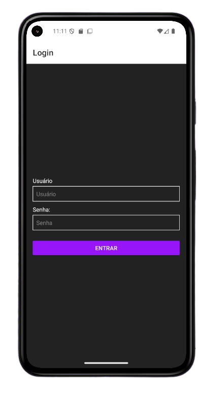

# My First React Native App

## 📱 Sobre o projeto

Este projeto foi criado com o objetivo de **aprender React Native** e entender os conceitos fundamentais de desenvolvimento mobile usando essa tecnologia.

A ideia é **recriar** o mesmo projeto que eu já havia feito anteriormente usando **Vue.js**, mas desta vez adaptando toda a lógica e interface para o **React Native**, explorando suas diferenças e boas práticas.

---

## 🎯 Objetivos

- Praticar os conceitos básicos do React Native.
- Reproduzir a estrutura de um CRUD que fiz em Vue.
- Entender as diferenças de desenvolvimento entre web e mobile.
- Trabalhar com **componentes funcionais**, **hooks** (`useState`, `useContext`), **estilização com StyleSheet** e o **navegador de rotas** (em etapas futuras).

---

## 🚀 Tecnologias utilizadas

- **React Native**
- **Expo** (para facilitar o desenvolvimento e testes)
- **JavaScript (ES6+)**
- **React Navigation** (para rotas e transições)
- **Context API** (para autenticação)
- **Android Studio** (para emulador)

---

## 💡 Funcionalidades implementadas

✅ Transições animadas entre telas com **React Navigation**  
✅ Sistema de **autenticação** simples utilizando **Context API**  
✅ Navegação condicional: proteção de rotas privadas (ex.: `Lista`)  
✅ **Logout** funcional  
✅ **Ícones** adicionados para melhorar a interface  
✅ Estilo adaptado para mobile com **StyleSheet**

---

## 🚧 Próximos passos

- Construir uma **lista CRUD** utilizando armazenamento local, equivalente ao **localStorage** do React para a web.
- Explorar o uso do **AsyncStorage** ou outras soluções de persistência no React Native para salvar dados localmente.
- Implementar funcionalidades de **criação**, **leitura**, **atualização** e **exclusão** na lista.
- Melhorar a interface e a experiência do usuário.
- Adicionar testes e tratar possíveis erros no fluxo de dados.

---

## 📱 Telas

|  |  |

---

## 📝 Como rodar o projeto

1. Clone o repositório:

```bash
git clone <link-do-repositório>
```
